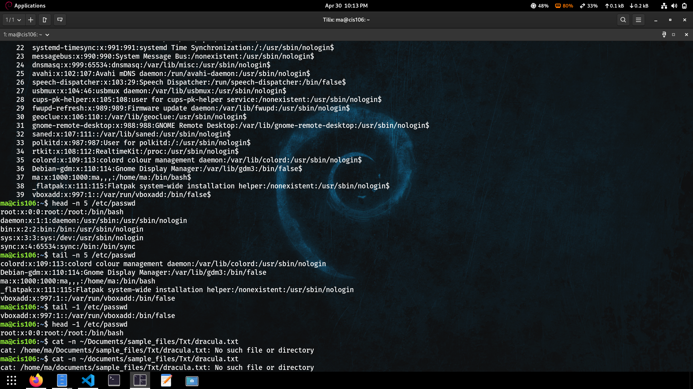
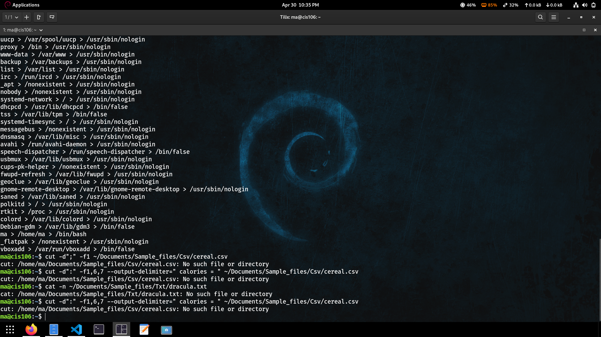
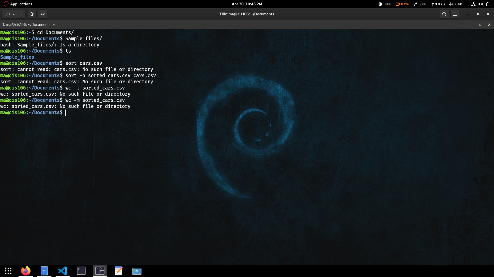
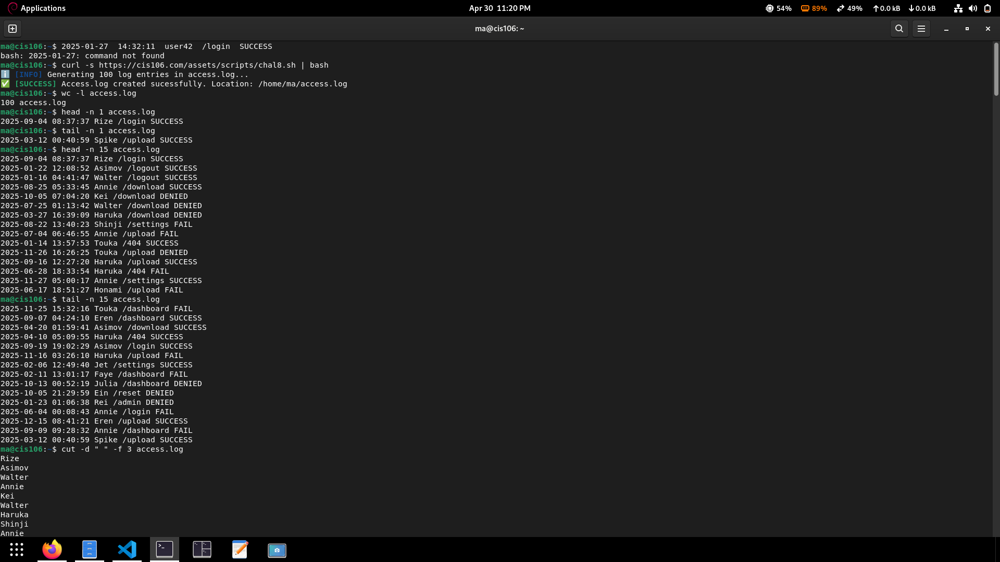
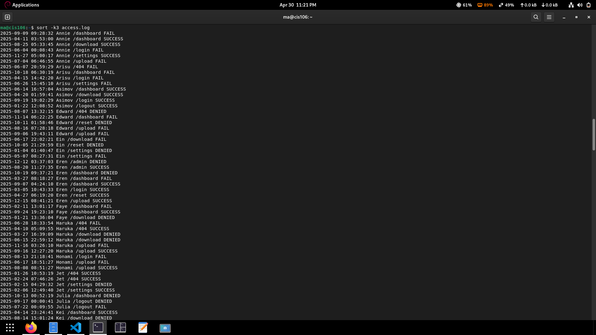
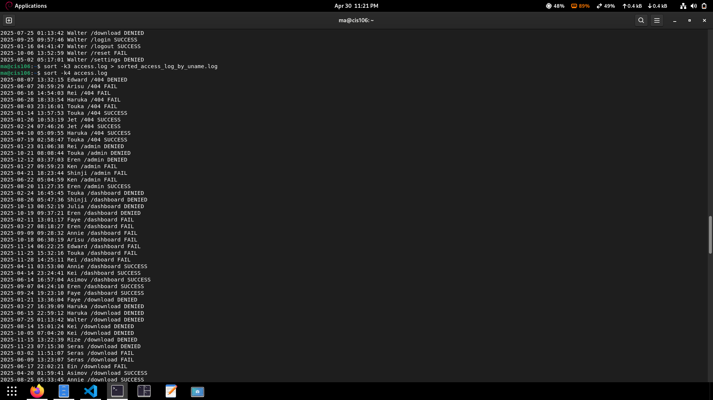
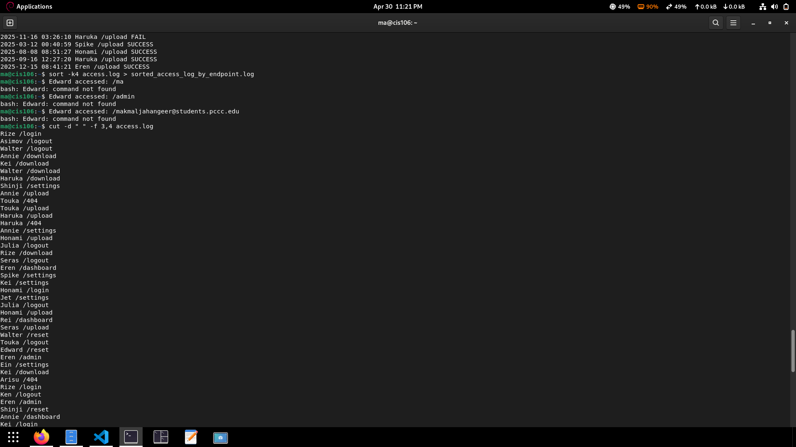

# Lab 8

## Question 1 Practice Exercise

### Practice 1


### Practice 2


### Practice 3



## Question 2 Challenge Question

### Lab 8 – Access Log Analysis

#### Question 1: Number of Logs

**Command:**

```bash
wc -l access.log
```

**Explanation:**
Counts the total number of lines in the file, which equals the number of log entries.

---

## Question 2: First User to Interact

**Command:**

```bash
head -n 1 access.log
```

**Explanation:**
Displays the first log entry. The username is the 3rd field.

---

## Question 3: Last User to Interact

**Command:**

```bash
tail -n 1 access.log
```

**Explanation:**
Displays the last log entry. The username is the 3rd field.

---

## Question 4: First 15 Events

**Command:**

```bash
head -n 15 access.log
```

**Explanation:**
Displays the first 15 log entries from the file.

---

## Question 5: Last 15 Events

**Command:**

```bash
tail -n 15 access.log
```

**Explanation:**
Displays the last 15 log entries from the file.

---

## Question 6: List of All Usernames

**Command:**

```bash
cut -d " " -f 3 access.log
```

**Explanation:**
Extracts the 3rd field (username) from each log entry.

---

## Question 7: Sort Logs by Username

**Command:**

```bash
sort -k3 access.log
```

**Explanation:**
Sorts the log entries alphabetically based on the username (3rd field).

---

## Question 8: Sort Logs by Endpoint

**Command:**

```bash
sort -k4 access.log
```

**Explanation:**
Sorts the log entries alphabetically based on the endpoint (4th field).

---

## Question 9: Display User Actions

**Command:**

```bash
cut -d " " -f 3,4 access.log
```

**Explanation:**
Extracts usernames and endpoints to show what each user accessed.







