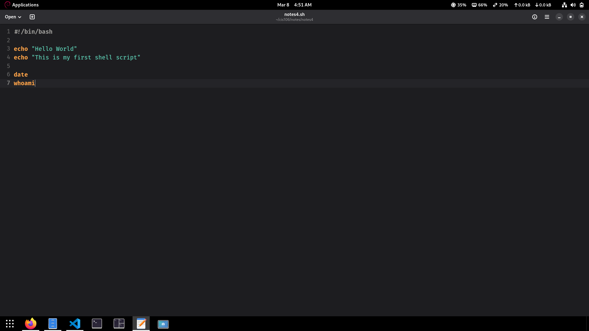
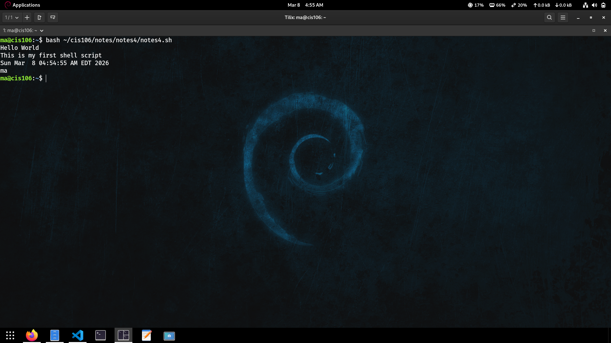

# Notes 4 

## How to install and remove software using APT command 
APT (Advanced Package Tool) is the package manager used in Ubuntu and Debian-based Linux systems. It helps you install, update, remove, and manage software from the terminal.

Step 1: Update the Package List
Before installing any software, update the package list so your system knows about the latest versions.
* `sudo apt update`

Step 2: Install Software
To install software, use the install command.
Example: Installing git
* `sudo apt install git`
You will be asked to confirm installation.
Press: Y

Step 3: Check if the Software is Installed
After installation, verify it.
* `git --version`

Step 4: Remove Software
To remove software but keep configuration files:
* `sudo apt remove git`

Step 5: Remove Software Completely
To remove software including configuration files:
* `sudo apt purge git`

Step 6: Clean Unused Packages
After uninstalling software, you can remove unnecessary dependencies.
* `sudo apt autoremove`

## How to create a shell script step by step including screenshots and how to run it. Try to be as detailed as possible.
A shell script is a file containing commands that the Linux shell executes automatically.

Step 1: open the text editor, create a script.

Step 2: Save the script.

step 3: Run the script in terminal.
`Hello World
This is my first shell script
Sun Mar 9 12:30:45
username`

### screenshot: 

