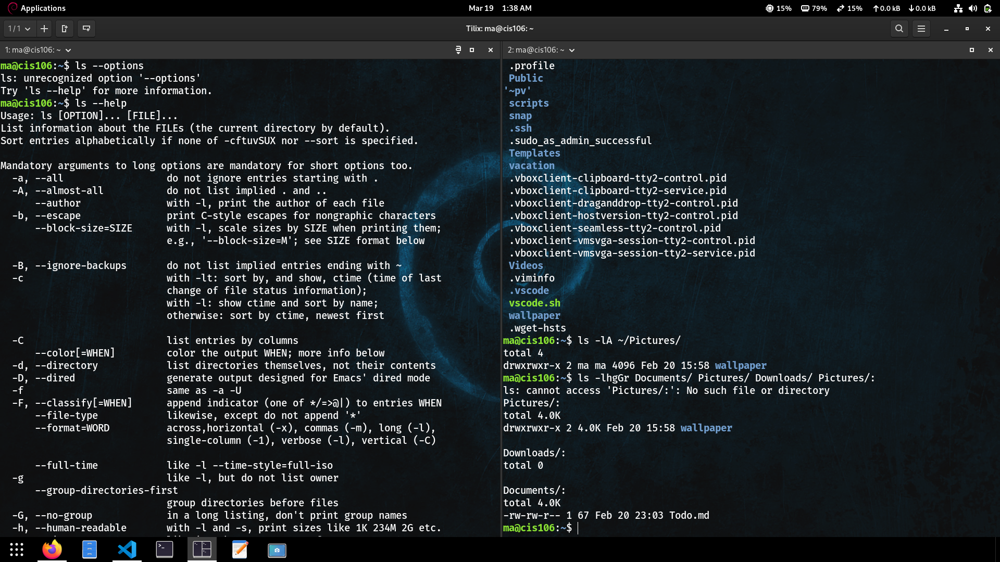

# Notes 5

## Commands for navigating the file system

## LS

### Definiton
* is is used for listing files and directions.
* By default it will list the current directory when no directory is specified.
* Listing means to see what is inside a directory.
* I use this command whenever I want to "open and see" what is inside a given folder in my Linux system.
* I can also use this command when I need to see some information (metadata) of a file. For example, when it was last edited, its size, permissions, etc.

### FORMULA/USAGE
* `ls` + `option` + `directory(ies) or file to list`
  
### EXAMPLES
* See all the options of the ls command:
  * `ls --help`
* List all the files including hidden files in current directory: 
  * `ls -A`
* Long list a directory 
  * `ls -lA ~/Pictures`
* Long list multiple directories excluding group and owner information, with human readable file size and sorted in reverse order. 
  * `ls -lhgGr Documents/ Pictures/`
  

## PWD

### Definition
* It is a command in Linux/Unix used to display the absolute path of the current directory you are in.
* The “working directory” is simply the folder/directory in which your terminal session is currently operating.
* The absolute path is the full path from the root directory / to your current folder.
* Essentially, `pwd` tells you: “Where am I in the filesystem right now?”

### FORMULA/USAGE
* The general usage is very simple:
  * `pwd [options]`

### EXAMPLES
* Suppose your directory structure is:
  * `/home/user/Documents/Projects`
* You navigate to the Projects folder:
  * `cd /home/user/Documents/Projects`
* Now you want to know where you are:
  * `pwd`
* Output:
  * `/home/user/Documents/Projects`
* Using the options with symbolic links:
  * `pwd -L   # Shows the logical path `
  * `pwd -P   # Shows the physical path`

### DEFINITION
* It is a command in Linux/Unix used to navigate between directories in the filesystem.
* The “working directory” is the folder your terminal is currently operating in, and cd lets you move from one folder to another.
  
### FORMULA/USAGE
* The general syntax is:
  * `cd [directory_path]`
  
### EXAMPLES
* Suppose your directory structure is:
  * `/home/user/Documents/Projects`
  * `/home/user/Documents/Notes`
* You are in `/home/user/Documents`:
  * `pwd` 
  * `# Output: /home/user/Documents`
* Go to `Projects` folder (relative path):
  * `cd Projects`
  * `pwd`
  * `# Output: /home/user/Documents/Projects`
* Go up one directory (parent folder):
  * `cd ..`
  * `pwd`
  * `# Output: /home/user/Documents`
* Go to `Notes` folder using absolute path:
  * `cd /home/user/Documents/Notes`
  * `pwd`
  * `# Output: /home/user/Documents/Notes`
* Go back to the previous directory:
  * `cd -`
  * `pwd`
  * `# Output: /home/user/Documents/Projects`

#### What is a variable?
A name that stores a value which can be used later in a program or terminal session.

#### How do I use a variable?
Assign a value to a name and reference it using `$` in the terminal or script.

#### What is an environment variable?
A special variable that affects the behavior of processes and is available system-wide.

#### What is a user defined variable?
A variable created by the user in a shell session or script, usually only available in that session.

#### What is the root directory?
The top-most directory in the Linux filesystem, represented by `/`.

#### What does “Parent Directory” mean?
The directory located one level above the current directory.

#### What does “Current working directory” mean?
The directory you are currently in within the terminal session.

#### What is an absolute path? Include an example
The full path from the root directory `/` to a file or folder, independent of your current location.

#### What is a relative path? Include an example
A path to a file or folder that is relative to the current working directory.

#### What is the difference between “Your home directory” and “The home directory”?
* Your home directory: The specific directory assigned to your user account.
* The home directory: The generic concept of a home directory that contains all users’ directories.

