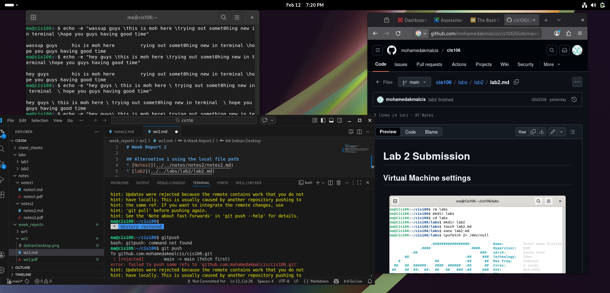

# Week Report 2

## Alternative 1 using the local file path 
* [Notes2](../../notes/notes2/notes2.md)
* [lab2](../../labs/lab2/lab2.md)

## Alternative 2 using the github url 
* [Notes2](https://github.com/mohamedakmalcis/cis106/blob/main/notes/notes2/notes2.md)
* [lab2](github.com/mohamedakmalcis/cis106/blob/main/labs/lab2/lab2.md)

## Debian Desktop
